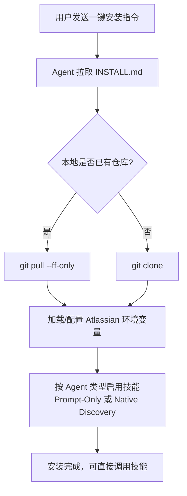

# sl-skills 分享手册

> 一句话介绍：`sl-skills` 是一套面向 AI Agent 的可复用工作流，让 Jira/PR/Confluence/方案评审等高频任务标准化、可追踪、可复用。

## 1. 能解决什么问题

团队在使用 Agent 时，常见痛点是：
- 同类任务每次都要重复解释
- 不同人用法不一致，结果质量波动
- 敏感信息和执行边界难统一

`sl-skills` 的目标是把这些任务固化成标准流程：
- 一致性：同类任务同一套步骤
- 效率：减少重复沟通
- 安全性：把规则（如 token 脱敏）写进技能规范

---

## 2. 当前有哪些技能

- `jira-issue-reader`：读取 Jira 卡片并总结上下文
  - /jira: SL-49454 是什么需求，设计一个方案
  - 帮我看看 SL-49454 目前什么进度
- `bitbucket-pr-reviewer`：拉取 PR + Diff，做结构化 Code Review，支持发评论
  - code review https://bitbucket.org/starlinglabs/api.shoplineapp.com/pull-requests/16042
  - 将review 结果评论到PR
- `confluence-page-manager`：读取/创建/更新 Confluence 页面
  - 读取https://shopline.atlassian.net/wiki/spaces/EN/pages/4872044549/-2026-03-13文件内容，并设计详细落地方案
  - 更新设计到confluence中
- `debate-workflow`：多角色辩论式技术评审（高风险改动先论证）
  - /debate 基于SL-49454设计方案
- `reset-sl-skill-config`：重置 Atlassian/Bitbucket 本地配置

---

## 3. 安装方式（推荐一键）

### 3.1 一键安装（推荐）
只要把下面这句发给 Agent：

```text
Fetch and follow instructions from: https://github.com/liangwenhui/sl-skills/blob/main/INSTALL.md
```

适用场景：
- 首次安装
- 重新安装
- 更新到最新版本

### 3.2 安装流程图



### 3.3 Native Discovery（以 Codex 为例）

```bash
mkdir -p "${CODEX_HOME:-$HOME/.codex}/skills"
ln -sfn /ABSOLUTE/PATH/TO/sl-skills/skills/<skill-name> "${CODEX_HOME:-$HOME/.codex}/skills/<skill-name>"
```

---

## 4. 如何自己设计一个 Skill

设计原则：一个 Skill 只解决一类问题，输入/输出清晰、失败可恢复。

### 4.1 六步法
1. 定义目标：这个 Skill 解决什么问题
2. 定义输入：必填、可选、默认值
3. 设计工作流：校验 -> 执行 -> 输出 -> 失败兜底
4. 脚本化动作：可复用逻辑放 `skills/scripts/*.sh`
5. 加安全规则：敏感信息不回显、写操作要确认
6. 验证：至少覆盖正常路径 + 异常路径

### 4.2 设计流程图


### 4.3 最小模板

````markdown
---
name: my-skill
description: 一句话说明用途与触发场景
---

# Goal
描述要解决的问题。

# Inputs
- required:
- optional:

# Workflow
1. 校验输入
2. 检查环境
3. 执行脚本
4. 输出结果

# Execution
```text
skills/scripts/my_skill.sh <arg1> <arg2>
```

# Rules
- 不泄露敏感信息
- 失败时给出下一步可执行建议
````

---

## 5. 推荐实践

- 文档先行：先写 `SKILL.md`，再落脚本
- 最小闭环：先做 MVP，跑通核心路径
- 输出稳定：统一结果格式，便于自动化消费
- 规则前置：权限、脱敏、危险操作确认写清楚
- 持续演进：按真实使用反馈迭代

---

